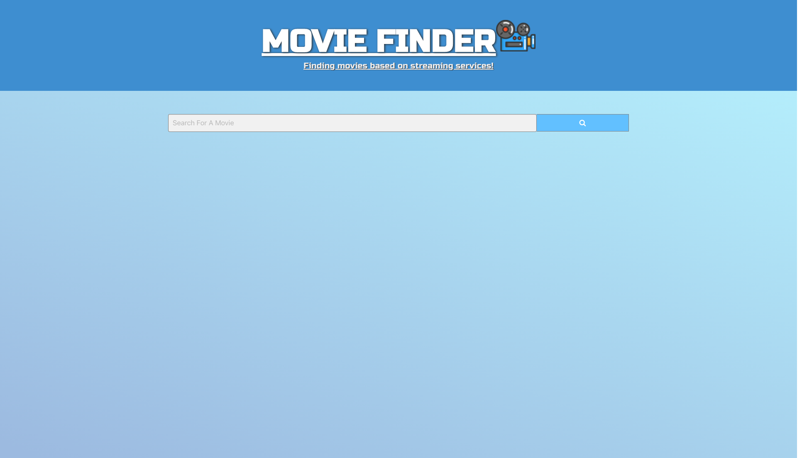
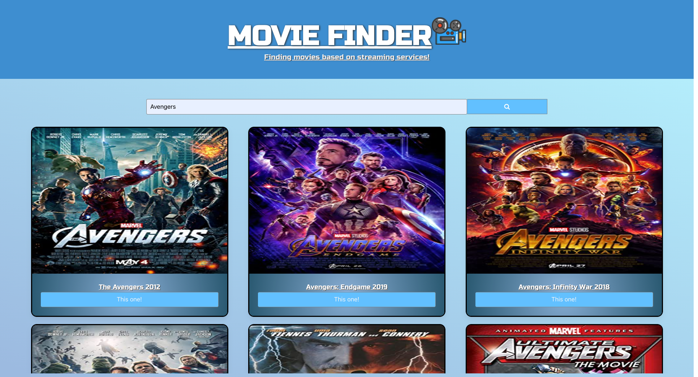
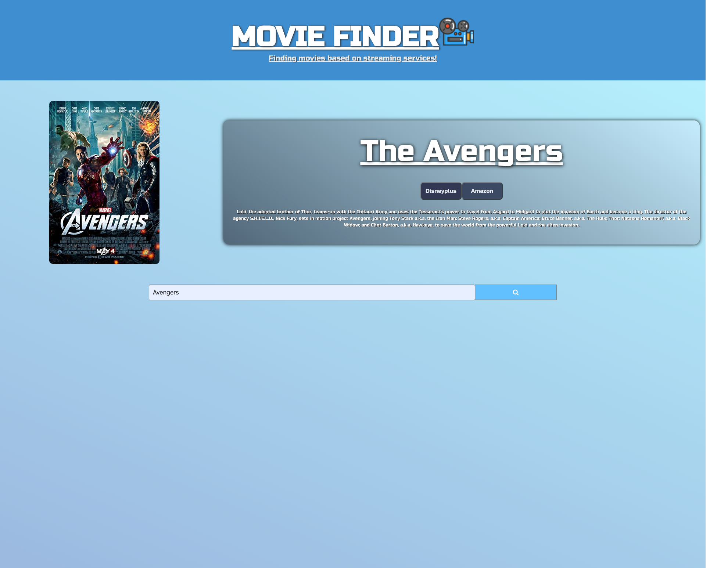

# Movie-Finder

## Description
    We devoloped a website that will allow you to easily find which streaming service a movie is on. Using HTML, CSS, Bulma, JS and Jquery our group created a simple yet very functional user interface. By first searching through an imbd fetch request to find the correct movie you will be shown a list of relevant searches to choose from. Once the user finds their movie then they can select it and will prompt them with links to the websites or an error message. The user can then search for a new movie or select a button.

## Installation

To install this project go to https://github.com/israelmrios/Movie-Finder and copy the SSH key to clone it to your terminal.

## Usage

Go to https://israelmrios.github.io/Movie-Finder/ and search any movie you want with the input region. Next, find the specificy movie you were looking for and click the button below it. If it is available on any of the top 6 streaming platforms a button will be displayed with a link to the movie.

## Credits

    Aydin Macias

    Carlos Hernandez

    Isreal Rios

    Justin Barner

## Liscense

    MIT License

    Copyright (c) [year] [fullname]

    Permission is hereby granted, free of charge, to any person obtaining a copy
    of this software and associated documentation files (the "Software"), to deal
    in the Software without restriction, including without limitation the rights
    to use, copy, modify, merge, publish, distribute, sublicense, and/or sell
    copies of the Software, and to permit persons to whom the Software is
    furnished to do so, subject to the following conditions:

    The above copyright notice and this permission notice shall be included in all
    copies or substantial portions of the Software.

    THE SOFTWARE IS PROVIDED "AS IS", WITHOUT WARRANTY OF ANY KIND, EXPRESS OR
    IMPLIED, INCLUDING BUT NOT LIMITED TO THE WARRANTIES OF MERCHANTABILITY,
    FITNESS FOR A PARTICULAR PURPOSE AND NONINFRINGEMENT. IN NO EVENT SHALL THE
    AUTHORS OR COPYRIGHT HOLDERS BE LIABLE FOR ANY CLAIM, DAMAGES OR OTHER
    LIABILITY, WHETHER IN AN ACTION OF CONTRACT, TORT OR OTHERWISE, ARISING FROM,
    OUT OF OR IN CONNECTION WITH THE SOFTWARE OR THE USE OR OTHER DEALINGS IN THE
    SOFTWARE.